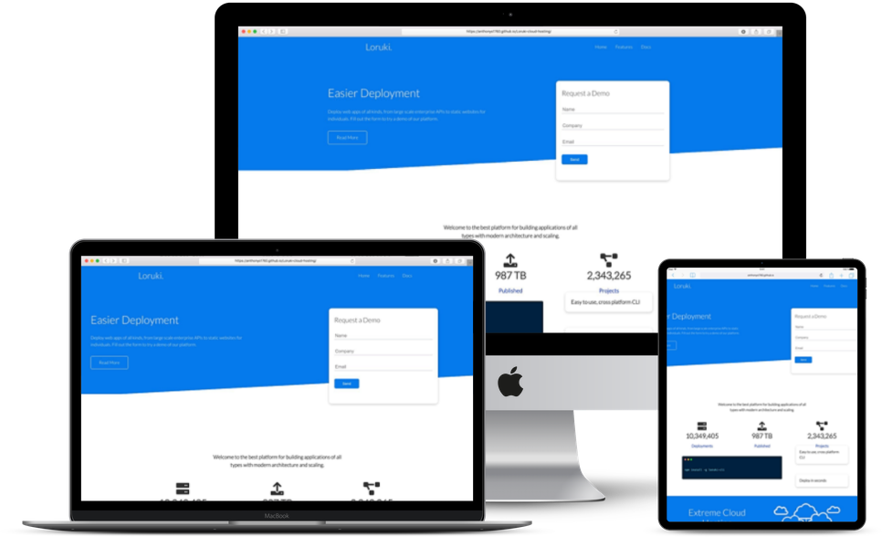

# Loruki Cloud Hosting Platform

Fake Cloud hosting website with documentation and installation instructions. 

## Project Sections

- Start Enrollment
- Sign Up For Newsletters
- Virtual Training
- Hybrid Training
- In-Person Training
- Instructors
- Frequently Asked Questions
- Contact Info
 
## Steps to execute this App:
- Download the entire code 
- Open up the index.html.
- [View Live Site]()

## Technologies used: 
- HTML
- CSS
- Bootstrap 5
- Javascript

