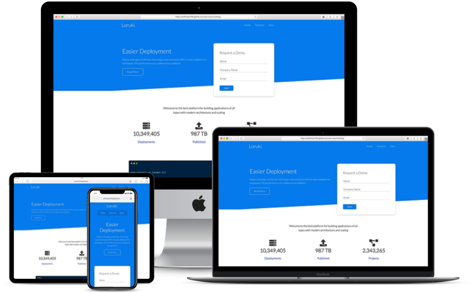

# Cumulus Cloud Hosting Platform

Fake Cloud hosting website with documentation and installation instructions. Deploy web apps of all kinds, from large scale enterprise APIs to static websites for individuals. Fill out the form to try a demo of our platform

## Project Specifications

- Request a Demo
- Easy to use, cross platform CLI
- Deploy in seconds
- Extreme Cloud Hosting
- Documentation Page
 
## Steps to execute this App:
- Download the entire code 
- Open up the index.html.
- [View Live Site](https://anthonys1760.github.io/Loruki-cloud-hosting/)

## Technologies used: 
- HTML
- CSS
- Javascript

